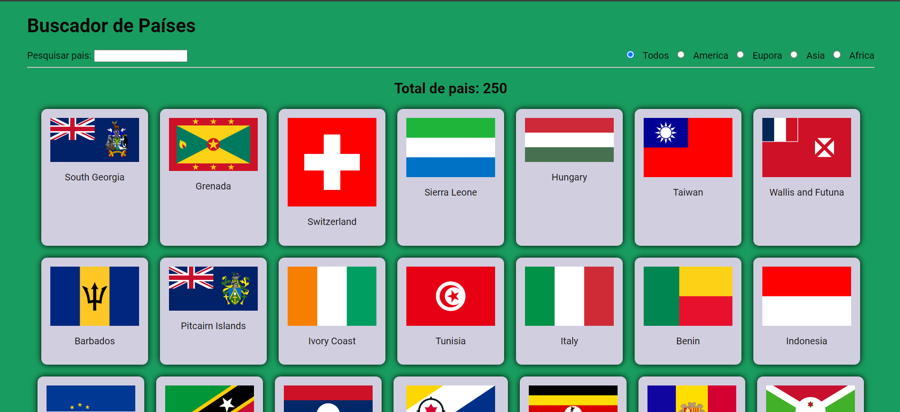
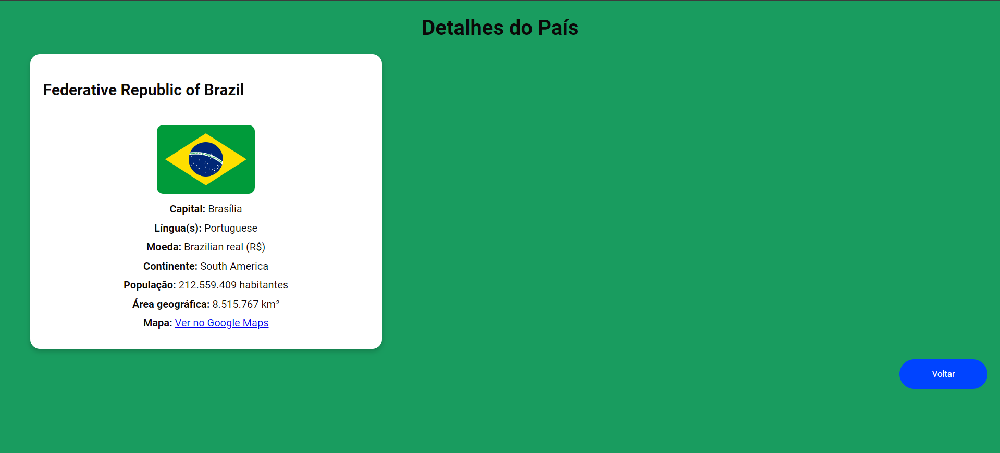

# Projeto Buscador de Países



Este projeto permite que o usuário explore e visualize informações detalhadas sobre países ao redor do mundo. A página inicial exibe uma lista de países e, ao clicar em cada um deles, o usuário será redirecionado para uma página de detalhes com mais informações sobre o país selecionado.



## Funcionalidades

- Exibição de uma lista de países.
- Ao clicar em um país, o usuário é direcionado para uma página que exibe detalhes sobre o país.
- Informações detalhadas exibidas na página do país incluem:
  - Nome oficial do país
  - Bandeira
  - Capital
  - Línguas faladas
  - Moeda
  - Continente
  - População
  - Área geográfica
  - Link para o Google Maps do país
- Design moderno e responsivo, com a página de detalhes centralizada.

## Tecnologias Utilizadas

- **HTML**: Estrutura do conteúdo da página.
- **CSS**: Estilização visual, responsividade e layout das páginas.
- **JavaScript**: Lógica para buscar dados, redirecionamento entre páginas e manipulação de conteúdo dinâmico.
- **API REST Countries**: Fonte dos dados sobre os países.

## Como Funciona

1. **Página inicial**: Ao carregar a página inicial, uma lista de países é exibida. Cada país é apresentado dentro de uma caixa, com seu nome e bandeira.

2. **Navegação para página de detalhes**: Ao clicar em qualquer país, o usuário é redirecionado para uma página de detalhes daquele país, que mostra mais informações sobre ele.

3. **Página de detalhes**: Esta página exibe informações mais completas sobre o país selecionado, como capital, população, moedas, continentes, e mais.

## Como Rodar o Projeto

1. Clone este repositório:
   ```bash
   git clone https://github.com/juniorlima82/buscador-de-paises.git
